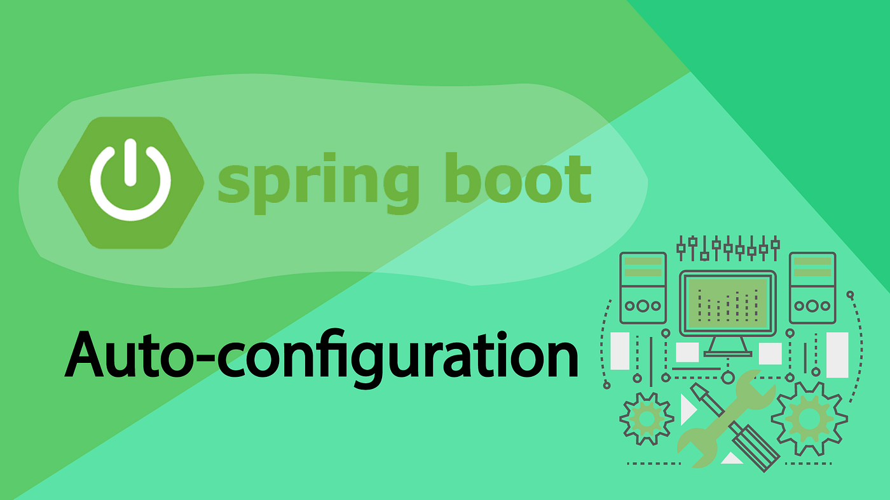
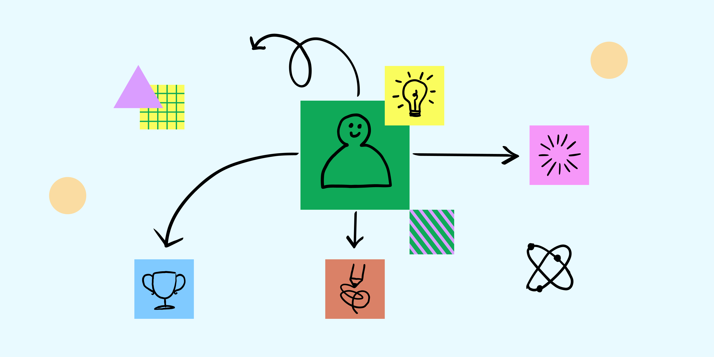
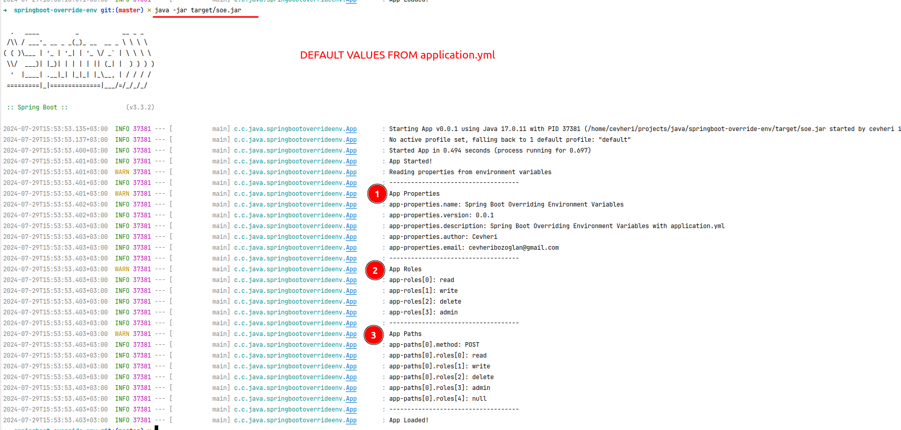
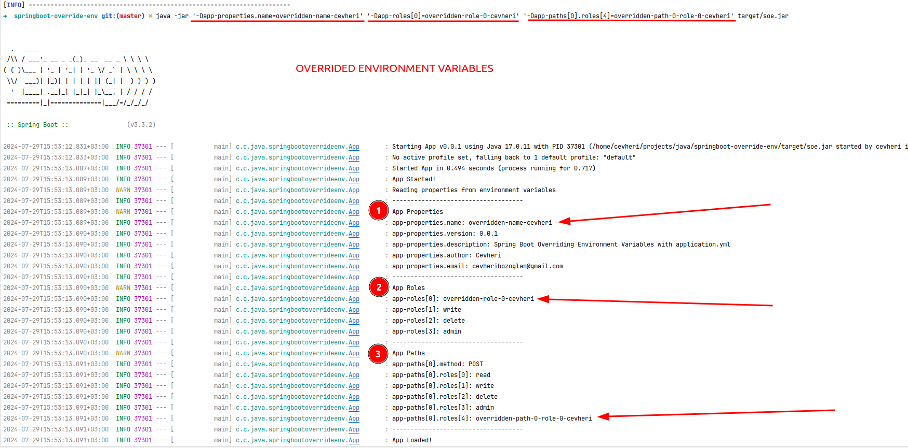
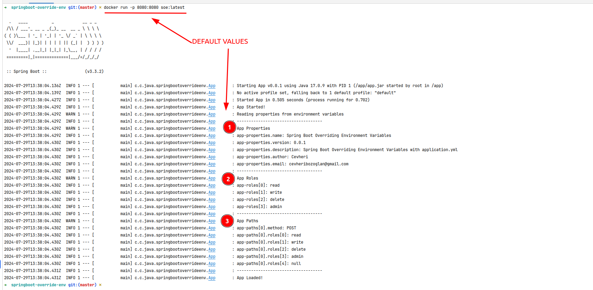
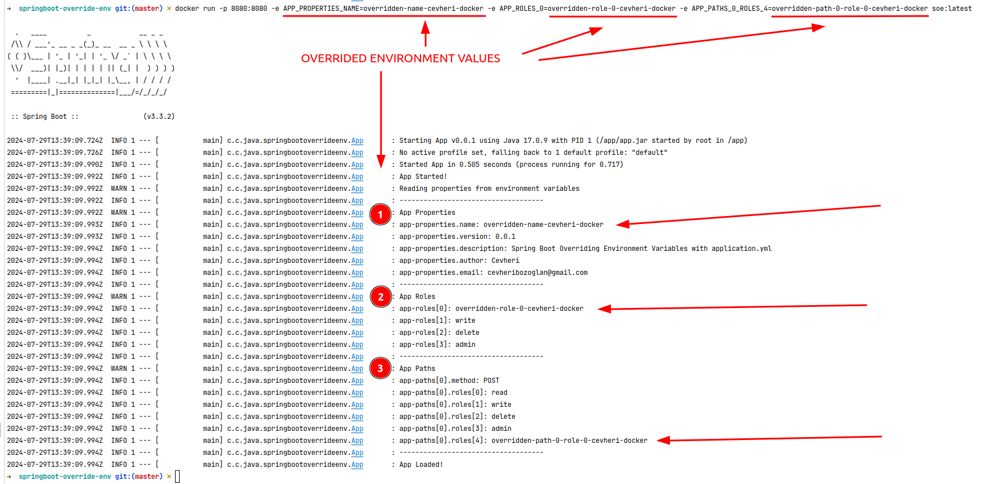

# Java Spring Boot Overriding Environment Variables Guide


This is an example of overriding the application.yml file with the OS environment variables. 
`Single` or `Array` environment variables can be overridden.



We talk about many ways to override environment variables in a Spring Boot application. Not autoconfiguration values :(

---

## Understanding Environment Variables
* Your Spring Boot application has a `application.yml` or `application.properties` file.
* The application properties are converted to environment variables when you run the Spring Boot application.
* The environment variables are key-value pairs that are set in the operating system.
* They are used to configure applications and services.
* Many ways to override environment variables in a Spring Boot application.

---

## Overview
1. This guide will show you how to override environment variables in a Spring Boot application.
2. Single and array environment variables will be overridden.
3. When you run a Spring Boot application, the application properties are converted to environment variables.
4. You can override environment variables using the `-D` flag when java -jar is used.
5. You can override environment variables using the `-e` flag when running a Spring Boot application in a Docker container.
6. You can override environment variables using ConfigMaps and Secrets when running a Spring Boot application in a Kubernetes cluster.
7. You can override environment variables using the `application.yml` file from git repository with spring cloud config server.

----

## Prerequisites
* JDK 17
* Maven 3.9x
* Spring Boot 3x

---

## Getting Started
* Clone the repository
```shell
git clone https://github.com/cevheri/java-spring-boot-overriding-environment-variables.git
```

* Change directory
```shell
cd java-spring-boot-overriding-environment-variables
```

* Run the Spring Boot application
```shell
mvn spring-boot:run
```

---


## Our Use Cases

4 and 5 are the most common use cases for overriding environment variables in a Spring Boot application. Maybe next time we can talk about the Kubernetes and Spring Cloud Config Server use cases.

---

## Environments Naming Convention
When you run a Spring Boot application, the application properties are converted to environment variable like UPPER_CASE with underscores.

* application.yml file
```yml
app-object:
  name: "Spring Boot Overriding Environment Variables"
  version: "0.0.1"
  description: "Spring Boot Overriding Environment Variables with application.yml"
  author: "Cevheri"
  email: "cevheribozoglan@gmail.com"
```
* OS Environment Variable
```shell
APP_OBJECT_NAME=overridden-name
APP_OBJECT_VERSION=overridden-version
APP_OBJECT_DESCRIPTION=overridden-description
APP_OBJECT_AUTHOR=overridden-author
APP_OBJECT_EMAIL=overridden-email
```

---

## Use Cases
Environment variables are key-value pairs that are set in the operating system.
They are used to configure applications and services.

### java -jar
When you run a Spring Boot application using the `java -jar` command, you can override environment variables using the `-D` flag.


### docker run
When you run a Spring Boot application in a Docker container, you can override environment variables using the `-e` flag.
    

---

## Build
### Maven Build
```shell
mvn clean install
```

### Build Docker Image
```shell
docker build -t soe:latest .
```

---

## Run
Run the Spring Boot application using the `java -jar` command. 

### Java
#### Simple
```shell
java -jar target/soe.jar
```

---

#### Override Environment Variables
```shell
java -jar '-Dapp-object.name=overridden-name-cevheri' '-Dapp-arrays.roles[0]=overridden-role-0-cevheri' '-Dapp-multiple.paths[0].roles[0]=overridden-path-0-role-0-cevheri' target/soe.jar
```


---

### Docker
#### Simple
```shell
docker run -p 8080:8080 soe:latest
```

#### Override Environment Variables
```shell
docker run -p 8080:8080 -e APP_OBJECT_NAME=overridden-name-cevheri-docker -e APP_ARRAYS_ROLES_0=overridden-role-0-cevheri-docker -e APP_MULTIPLE_PATHS_0_ROLES_0=overridden-path-0-role-0-cevheri-docker soe:latest
```



---
## Using Spring Bean
```java
@Configuration
@ConfigurationProperties(prefix = "app-multiple")
public class AppPaths {

    private List<Path> paths;

    public List<Path> getPaths() {
        return paths;
    }

    public void setPaths(List<Path> paths) {
        this.paths = paths;
    }

    public static class Path {
        private String method;
        private List<String> roles;

        public String getMethod() {
            return method;
        }

        public void setMethod(String method) {
            this.method = method;
        }

        public List<String> getRoles() {
            return roles;
        }

        public void setRoles(List<String> roles) {
            this.roles = roles;
        }
    }
}
```
You should override whole array object like below.
```shell
docker run -p 8080:8080 \
-e APP_MULTIPLE_PATHS_0_METHOD=NEW_POST \
-e APP_MULTIPLE_PATHS_0_ROLES_0=new_create \
-e APP_MULTIPLE_PATHS_0_ROLES_1=new_read \
-e APP_MULTIPLE_PATHS_0_ROLES_2=new_update \
-e APP_MULTIPLE_PATHS_0_ROLES_3=new_delete \
-e APP_MULTIPLE_PATHS_0_ROLES_4=new_admin \
 soe:latest
 
```

---

## Test

```shell
mvn test
```

---

## Conclusion
* This guide showed you how to override environment variables in a Spring Boot application. 
* Single and multiple(array) environment variables were overridden. 
* When you run a Spring Boot application, the application properties are converted to environment variables. 
* You can override environment variables using the `-D` flag when java -jar is used. 
* You can override environment variables using the `-e` flag when running a Spring Boot application in a Docker container.

---

### Reference Documentation

For further reference, please consider the following sections:
* https://spring.io/guides/gs/spring-boot
* https://docs.spring.io/spring-boot/reference/features/external-config.html
* https://maven.apache.org/guides/index.html
* https://docs.spring.io/spring-boot/3.3.2/maven-plugin
* https://docs.spring.io/spring-boot/3.3.2/maven-plugin/build-image.html
* https://docs.docker.com/compose/environment-variables/set-environment-variables/
